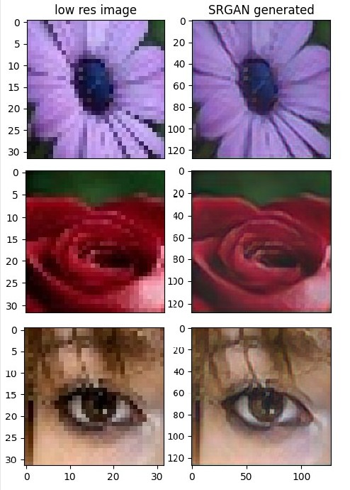

# SRGAN

A generative adversarial network (GAN) based on the SRGAN architecture from the 2016 paper, "Photo-Realistic Single Image Super-Resolution Using a Generative Adversarial Network" by C. Ledig et al. 

## About
- Takes in an image of 32x32 pixels and outputs an image with an increased resolution of 128x128 pixels.
- Trained using the <a href="https://press.liacs.nl/mirflickr/mirdownload.html" target="_blank">MIRFLICKR</a> dataset.
  
## How to run
- Install the required dependencies
  ```bash
  pip install -r requirements.txt
  ```
- In `inference.py`, change the `im_name` variable into the designated image file name.
- Run `inference.py`.
  ```bash
  python inference.py
  ```
- The matplotlib window should pop up showing the comparison, the newly generated image is then saved in the folder `generated_samples` if the target save path is unchanged.

## Demo



## Architecture


